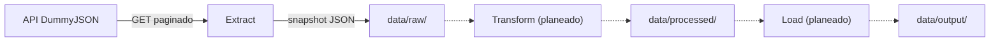

# ETL CSV/Excel Data Pipeline

A portfolio ETL project: extract, transform, and load retail data from a
public API into analysis-ready CSV/Excel outputs. Currently implements the
**Extract** stage; Transform and Load are in progress.

---

## 🇬🇧 English

### Overview
This project pulls a retail product catalog from the public
[DummyJSON API](https://dummyjson.com/docs/products), stores an immutable raw
snapshot, and will progressively clean/normalize it (Transform) into
analysis-ready CSV/Excel files (Load). It's built as a demonstration of
practical ETL engineering: pagination, retries/backoff, logging,
configuration-driven design, tests, and decision documentation.

### Status
| Stage | Status |
|---|---|
| Extract | ✅ Implemented |
| Transform | 🔜 Planned |
| Load | 🔜 Planned |

### Architecture


See [docs/data-lineage.md](docs/data-lineage.md) for full detail.

### Project structure
```
config/          Pipeline configuration (config.yaml)
data/
  raw/           Immutable raw snapshots (git-ignored)
  processed/     Cleaned/normalized data (planned)
  output/        Final deliverables (planned)
docs/
  adr/           Architecture Decision Records
  runbooks/      Operational runbooks
  data-lineage.md
  data-dictionary.md
logs/            Rotating log files (git-ignored)
src/
  extract/       Extract stage source code
  utils/         Shared utilities (logging, etc.)
tests/           Unit tests
```

### Getting started

**Prerequisites**: Python 3.10+

```bash
python -m venv .venv
# Windows
.venv\Scripts\activate
# macOS/Linux
source .venv/bin/activate

pip install -r requirements-dev.txt
```

**Run the extraction**:
```bash
python -m src.extract.extract_dummyjson
```
This fetches the full product catalog (~194 records) and writes a timestamped
snapshot to `data/raw/products_raw_<UTC_TIMESTAMP>.json`. See the
[extract runbook](docs/runbooks/extract-runbook.md) for details,
troubleshooting, and scheduling.

**Run the tests**:
```bash
pytest -q
```

### Documentation
- [CHANGELOG.md](CHANGELOG.md) — version history
- [docs/adr/](docs/adr/) — architecture decisions (why the source and storage
  format were chosen)
- [docs/runbooks/extract-runbook.md](docs/runbooks/extract-runbook.md) —
  how to run and troubleshoot the Extract stage
- [docs/data-lineage.md](docs/data-lineage.md) — end-to-end data flow
- [docs/data-dictionary.md](docs/data-dictionary.md) — field-by-field schema
  reference for the raw layer

### Roadmap
- **Transform**: flatten nested fields (`dimensions`, `meta`, `reviews`), type
  validation, data quality checks, output to `data/processed/`.
- **Load**: shape and export curated CSV/Excel deliverables to
  `data/output/`.

### About this project
This repository is part of a freelance/portfolio effort to demonstrate ETL
skills (data extraction, cleaning, and reporting with CSV/Excel/JSON). Feedback
and suggestions are welcome via issues.

---

## 🇪🇸 Español

### Descripción general
Este proyecto extrae un catálogo de productos retail desde la API pública
[DummyJSON](https://dummyjson.com/docs/products), almacena un snapshot crudo
inmutable, y progresivamente lo limpiará/normalizará (Transform) hasta
convertirlo en archivos CSV/Excel listos para análisis (Load). Está construido
como una demostración práctica de ingeniería ETL: paginación,
reintentos/backoff, logging, diseño basado en configuración, pruebas
automatizadas y documentación de decisiones.

### Estado
| Etapa | Estado |
|---|---|
| Extract | ✅ Implementada |
| Transform | 🔜 Planeada |
| Load | 🔜 Planeada |

### Arquitectura



Ver [docs/data-lineage.md](docs/data-lineage.md) para el detalle completo.

### Estructura del proyecto
```
config/          Configuración del pipeline (config.yaml)
data/
  raw/           Snapshots crudos e inmutables (ignorado por git)
  processed/     Datos limpios/normalizados (planeado)
  output/        Entregables finales (planeado)
docs/
  adr/           Registros de decisiones de arquitectura (ADR)
  runbooks/      Runbooks operativos
  data-lineage.md
  data-dictionary.md
logs/            Archivos de log rotativos (ignorado por git)
src/
  extract/       Código de la etapa Extract
  utils/         Utilidades compartidas (logging, etc.)
tests/           Pruebas unitarias
```

### Cómo empezar

**Prerrequisitos**: Python 3.10+

```bash
python -m venv .venv
# Windows
.venv\Scripts\activate
# macOS/Linux
source .venv/bin/activate

pip install -r requirements-dev.txt
```

**Ejecutar la extracción**:
```bash
python -m src.extract.extract_dummyjson
```
Esto descarga el catálogo completo (~194 registros) y escribe un snapshot con
timestamp en `data/raw/products_raw_<UTC_TIMESTAMP>.json`. Ver el
[runbook de extracción](docs/runbooks/extract-runbook.md) para más detalle,
resolución de problemas y programación de ejecuciones.

**Ejecutar las pruebas**:
```bash
pytest -q
```

### Documentación
- [CHANGELOG.md](CHANGELOG.md) — historial de versiones
- [docs/adr/](docs/adr/) — decisiones de arquitectura (por qué se eligió la
  fuente y el formato de almacenamiento)
- [docs/runbooks/extract-runbook.md](docs/runbooks/extract-runbook.md) — cómo
  ejecutar y resolver problemas de la etapa Extract
- [docs/data-lineage.md](docs/data-lineage.md) — flujo de datos de extremo a
  extremo
- [docs/data-dictionary.md](docs/data-dictionary.md) — referencia de esquema
  campo por campo de la capa cruda

### Hoja de ruta
- **Transform**: aplanar campos anidados (`dimensions`, `meta`, `reviews`),
  validación de tipos, controles de calidad de datos, salida a
  `data/processed/`.
- **Load**: dar forma y exportar entregables curados en CSV/Excel a
  `data/output/`.

### Sobre este proyecto
Este repositorio es parte de un esfuerzo freelance/portafolio para demostrar
habilidades de ETL (extracción, limpieza y reportería de datos con
CSV/Excel/JSON). Comentarios y sugerencias son bienvenidos vía issues.
