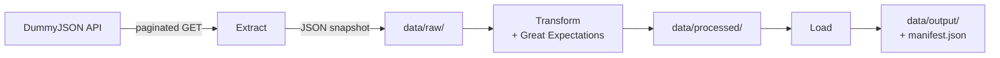
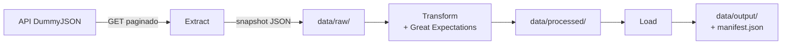

# ETL CSV/Excel Data Pipeline

An ETL project: extract, transform, and load retail data from a public API
into analysis-ready CSV outputs. Extract, Transform, and Load are all
implemented, with data quality checks (Great Expectations) and data contracts
along the way.

---

## 🇬🇧 English

### Overview
This project pulls a retail product catalog from the public
[DummyJSON API](https://dummyjson.com/docs/products), stores an immutable raw
snapshot, and will progressively clean/normalize it (Transform) into
analysis-ready CSV/Excel files (Load). It's built as a demonstration of
practical ETL engineering: pagination, retries/backoff, logging,
configuration-driven design, tests, and decision documentation.

### Status
| Stage | Status |
|---|---|
| Extract | ✅ Implemented |
| Transform | ✅ Implemented |
| Load | ✅ Implemented (CSV) |

The pipeline runs end-to-end: public API → raw JSON snapshot → validated,
normalized CSV tables → published CSV deliverables.

### Architecture



See [docs/data-lineage.md](docs/data-lineage.md) for full detail and
[docs/entity-relationship-diagram.md](docs/entity-relationship-diagram.md)
for the four-table schema (`products`, `product_reviews`, `product_tags`,
`product_images`) that Transform/Load produce — designed to be replicated
1:1 into a real database later.

### Project structure
```
config/          Pipeline configuration (config.yaml)
contracts/       Data contracts (Data Contract Specification YAML)
data/
  raw/           Immutable raw snapshots (git-ignored)
  processed/     Normalized, validated tables (git-ignored)
  output/        Published CSV deliverables + manifest.json (git-ignored)
docs/
  adr/           Architecture Decision Records
  runbooks/      Operational runbooks
  data-lineage.md
  data-dictionary.md
  entity-relationship-diagram.md
logs/            Rotating log files (git-ignored)
src/
  extract/       Extract stage source code
  transform/     Transform stage source code
  load/          Load stage source code
  quality/       Great Expectations data quality checks
  utils/         Shared utilities (logging, etc.)
tests/           Unit tests
```

### Getting started

**Prerequisites**: Python 3.10+

```bash
python -m venv .venv
# Windows
.venv\Scripts\activate
# macOS/Linux
source .venv/bin/activate

pip install -r requirements-dev.txt
```

**Run the full pipeline**:
```bash
python -m src.extract.extract_dummyjson     # API -> data/raw/*.json
python -m src.transform.transform_products  # data/raw/ -> data/processed/*.csv (+ quality checks)
python -m src.load.load_products            # data/processed/ -> data/output/*.csv + manifest.json
```
Extract fetches the full product catalog (~194 records) into a timestamped
snapshot. Transform normalizes it into four tables and validates it with
Great Expectations. Load publishes the validated tables as the final CSV
deliverables. See the runbooks linked below for details, troubleshooting,
and scheduling of each stage.

**Run the tests**:
```bash
pytest -q
```

### Documentation
- [CHANGELOG.md](CHANGELOG.md) — version history
- [docs/adr/](docs/adr/) — architecture decisions (data source, raw storage
  format, data contracts, data quality approach)
- Runbooks: [Extract](docs/runbooks/extract-runbook.md) ·
  [Transform](docs/runbooks/transform-runbook.md) ·
  [Load](docs/runbooks/load-runbook.md)
- [docs/data-lineage.md](docs/data-lineage.md) — end-to-end data flow
- [docs/data-dictionary.md](docs/data-dictionary.md) — field-by-field schema
  reference for the raw layer
- [docs/entity-relationship-diagram.md](docs/entity-relationship-diagram.md) —
  the four-table schema produced by Transform/Load
- [`contracts/`](contracts/) — per-table data contracts (Data Contract
  Specification YAML)

### Roadmap
- Migrate data contracts from YAML documentation to Pydantic models enforced
  at runtime (tracked as tech debt in
  [ADR 0004](docs/adr/0004-data-contracts-approach.md)).
- Historical/trend analysis across multiple snapshots (currently
  current-state grain only — see [docs/data-lineage.md](docs/data-lineage.md)).

### About this project
This repository demonstrates practical ETL engineering skills: data
extraction, normalization, automated data quality checks, and reporting with
CSV/JSON, backed by decision documentation (ADRs), operational runbooks, and
data contracts. Feedback and suggestions are welcome via issues.

---

## 🇪🇸 Español

### Descripción general
Este proyecto extrae un catálogo de productos retail desde la API pública
[DummyJSON](https://dummyjson.com/docs/products), almacena un snapshot crudo
inmutable, y progresivamente lo limpiará/normalizará (Transform) hasta
convertirlo en archivos CSV/Excel listos para análisis (Load). Está construido
como una demostración práctica de ingeniería ETL: paginación,
reintentos/backoff, logging, diseño basado en configuración, pruebas
automatizadas y documentación de decisiones.

### Estado
| Etapa | Estado |
|---|---|
| Extract | ✅ Implementada |
| Transform | ✅ Implementada |
| Load | ✅ Implementada (CSV) |

El pipeline corre de extremo a extremo: API pública → snapshot JSON crudo →
tablas CSV normalizadas y validadas → entregables CSV publicados.

### Arquitectura



Ver [docs/data-lineage.md](docs/data-lineage.md) para el detalle completo y
[docs/entity-relationship-diagram.md](docs/entity-relationship-diagram.md)
para el esquema de las cuatro tablas (`products`, `product_reviews`,
`product_tags`, `product_images`) que produce Transform/Load — diseñado para
replicarse 1:1 en una base de datos real más adelante.

### Estructura del proyecto
```
config/          Configuración del pipeline (config.yaml)
contracts/       Contratos de datos (YAML, Data Contract Specification)
data/
  raw/           Snapshots crudos e inmutables (ignorado por git)
  processed/     Tablas normalizadas y validadas (ignorado por git)
  output/        Entregables CSV publicados + manifest.json (ignorado por git)
docs/
  adr/           Registros de decisiones de arquitectura (ADR)
  runbooks/      Runbooks operativos
  data-lineage.md
  data-dictionary.md
  entity-relationship-diagram.md
logs/            Archivos de log rotativos (ignorado por git)
src/
  extract/       Código de la etapa Extract
  transform/     Código de la etapa Transform
  load/          Código de la etapa Load
  quality/       Validaciones de calidad con Great Expectations
  utils/         Utilidades compartidas (logging, etc.)
tests/           Pruebas unitarias
```

### Cómo empezar

**Prerrequisitos**: Python 3.10+

```bash
python -m venv .venv
# Windows
.venv\Scripts\activate
# macOS/Linux
source .venv/bin/activate

pip install -r requirements-dev.txt
```

**Ejecutar el pipeline completo**:
```bash
python -m src.extract.extract_dummyjson     # API -> data/raw/*.json
python -m src.transform.transform_products  # data/raw/ -> data/processed/*.csv (+ validación de calidad)
python -m src.load.load_products            # data/processed/ -> data/output/*.csv + manifest.json
```
Extract descarga el catálogo completo (~194 registros) en un snapshot con
timestamp. Transform lo normaliza en cuatro tablas y lo valida con Great
Expectations. Load publica las tablas validadas como entregables CSV finales.
Ver los runbooks abajo para más detalle, resolución de problemas y
programación de cada etapa.

**Ejecutar las pruebas**:
```bash
pytest -q
```

### Documentación
- [CHANGELOG.md](CHANGELOG.md) — historial de versiones
- [docs/adr/](docs/adr/) — decisiones de arquitectura (fuente de datos,
  formato de almacenamiento crudo, contratos de datos, enfoque de calidad)
- Runbooks: [Extract](docs/runbooks/extract-runbook.md) ·
  [Transform](docs/runbooks/transform-runbook.md) ·
  [Load](docs/runbooks/load-runbook.md)
- [docs/data-lineage.md](docs/data-lineage.md) — flujo de datos de extremo a
  extremo
- [docs/data-dictionary.md](docs/data-dictionary.md) — referencia de esquema
  campo por campo de la capa cruda
- [docs/entity-relationship-diagram.md](docs/entity-relationship-diagram.md) —
  el esquema de cuatro tablas que produce Transform/Load
- [`contracts/`](contracts/) — contratos de datos por tabla (YAML, Data
  Contract Specification)

### Hoja de ruta
- Migrar los contratos de datos de documentación YAML a modelos Pydantic
  aplicados en tiempo de ejecución (deuda técnica registrada en
  [ADR 0004](docs/adr/0004-data-contracts-approach.md)).
- Análisis histórico/de tendencias entre múltiples snapshots (hoy el grano es
  solo estado actual — ver [docs/data-lineage.md](docs/data-lineage.md)).

### Sobre este proyecto
Este repositorio demuestra habilidades prácticas de ingeniería ETL:
extracción de datos, normalización, controles de calidad automatizados y
reportería con CSV/JSON, respaldado por documentación de decisiones (ADRs),
runbooks operativos y contratos de datos. Comentarios y sugerencias son
bienvenidos vía issues.
