# Data Lineage

## Status
**Extract, Transform, and Load are all implemented.** The pipeline runs
end-to-end from the public API to publish-ready CSV files.

## Pipeline overview

```mermaid
flowchart LR
    A["DummyJSON API\nhttps://dummyjson.com/products\n(external, public, no auth)"]
    B["Extract\nsrc/extract/extract_dummyjson.py"]
    C["data/raw/\nproducts_raw_&lt;timestamp&gt;.json\n(immutable snapshot)"]
    D["Transform\nsrc/transform/transform_products.py\n+ Great Expectations checks"]
    E["data/processed/\nnormalized tables (CSV)"]
    F["Load\nsrc/load/load_products.py"]
    G["data/output/\nCSV deliverables + manifest.json"]

    A -->|HTTP GET, paginated| B
    B -->|write, one file per run| C
    C -->|read latest snapshot| D
    D -->|write, 4 tables| E
    E -->|copy + manifest| F
    F -->|write| G
```

## Stage detail

### 1. Source: DummyJSON Products API
- **Location**: `https://dummyjson.com/products`
- **Access pattern**: paginated `GET` requests (`limit`/`skip` query params).
- **Nature**: synthetic retail catalog data (194 products at time of writing),
  regenerated periodically by the provider. See
  [ADR 0002](adr/0002-data-source-selection.md).

### 2. Extract
- **Code**: [`src/extract/extract_dummyjson.py`](../src/extract/extract_dummyjson.py)
- **Config**: [`config/config.yaml`](../config/config.yaml)
- **Behavior**: fetches all pages, wraps them with `extracted_at`/`source`/
  `record_count` metadata, writes one JSON file per run.
- **Output**: `data/raw/products_raw_<UTC_TIMESTAMP>.json` (git-ignored, local
  disk artifact only).
- **Transformation applied**: none — this is a byte-for-byte-faithful copy of
  the API response, re-serialized. See [ADR 0003](adr/0003-raw-data-storage-format.md).

### 3. Transform
- **Code**: [`src/transform/transform_products.py`](../src/transform/transform_products.py)
- **Input**: the single **most recent** `data/raw/*.json` snapshot (current-state
  grain — see [Grain and identity notes](#grain-and-identity-notes) below).
- **Behavior**:
  - Flattens `dimensions.*` and `meta.*` into columns.
  - Explodes `reviews[]`, `tags[]`, and `images[]` into three separate
    child tables (see [ER diagram](entity-relationship-diagram.md)).
  - Computes derived columns: `price_with_discount`, `review_count`,
    `avg_review_rating`.
  - Validates the `products` table with Great Expectations before writing
    anything — critical checks abort the run; warning checks are logged only.
    See [ADR 0005](adr/0005-data-quality-great-expectations.md).
- **Output**: `data/processed/products.csv`, `product_reviews.csv`,
  `product_tags.csv`, `product_images.csv`.

### 4. Load
- **Code**: [`src/load/load_products.py`](../src/load/load_products.py)
- **Input**: `data/processed/*.csv`.
- **Behavior**: copies the four validated tables into `data/output/` as the
  final, publish-ready deliverables, and writes `manifest.json` (load
  timestamp + per-table row counts) for auditability.
- **Output**: `data/output/products.csv`, `product_reviews.csv`,
  `product_tags.csv`, `product_images.csv`, `manifest.json`.
- **Data contracts**: each output table's schema and quality rules are
  formalized in [`contracts/`](../contracts/) — see
  [ADR 0004](adr/0004-data-contracts-approach.md).

## Grain and identity notes
- The natural key from the source is `id` (product id), unique **within** a
  single API pull.
- Because the source data can change between extraction runs (see
  [ADR 0002](adr/0002-data-source-selection.md)), the same `id` may appear
  with different attribute values across snapshots.
- This pipeline deliberately uses a **current-state grain**: Transform always
  reads only the latest raw snapshot, so `product_id` is unique and stable
  *within* `data/processed/`/`data/output/` at any point in time, but does
  **not** represent a historical time series. If historical/trend analysis is
  needed later, that requires a new SCD2-style design keyed on
  `(product_id, extracted_at)` across multiple retained snapshots — noted as
  a possible future enhancement, not implemented here.
