# Data Lineage

## Status
Only the **Extract** stage is implemented so far. Transform and Load are
documented here as planned stages so the intended end-to-end lineage is clear;
this file will be updated as each stage is built.

## Pipeline overview

```mermaid
flowchart LR
    A["DummyJSON API\nhttps://dummyjson.com/products\n(external, public, no auth)"]
    B["Extract\nsrc/extract/extract_dummyjson.py"]
    C["data/raw/\nproducts_raw_&lt;timestamp&gt;.json\n(immutable snapshot)"]
    D["Transform (planned)\nflatten nested fields,\ntype/quality checks"]
    E["data/processed/\ncleaned, tabular data\n(CSV/Parquet)"]
    F["Load (planned)\naggregate / shape for\nreporting"]
    G["data/output/\nCSV / Excel deliverables"]

    A -->|HTTP GET, paginated| B
    B -->|write, one file per run| C
    C -->|read latest/selected snapshot| D
    D -->|write| E
    E -->|read| F
    F -->|write| G
```

## Stage detail

### 1. Source: DummyJSON Products API
- **Location**: `https://dummyjson.com/products`
- **Access pattern**: paginated `GET` requests (`limit`/`skip` query params).
- **Nature**: synthetic retail catalog data (194 products at time of writing),
  regenerated periodically by the provider. See
  [ADR 0002](adr/0002-data-source-selection.md).

### 2. Extract
- **Code**: [`src/extract/extract_dummyjson.py`](../src/extract/extract_dummyjson.py)
- **Config**: [`config/config.yaml`](../config/config.yaml)
- **Behavior**: fetches all pages, wraps them with `extracted_at`/`source`/
  `record_count` metadata, writes one JSON file per run.
- **Output**: `data/raw/products_raw_<UTC_TIMESTAMP>.json` (git-ignored, local
  disk artifact only).
- **Transformation applied**: none — this is a byte-for-byte-faithful copy of
  the API response, re-serialized. See [ADR 0003](adr/0003-raw-data-storage-format.md).

### 3. Transform (planned, not yet implemented)
- **Input**: one or more `data/raw/*.json` snapshots.
- **Expected responsibilities**:
  - Flatten nested objects (`dimensions.width/height/depth`, `meta.*`) into
    columns.
  - Explode or aggregate array fields (`tags`, `images`, `reviews`) depending
    on the target grain (one row per product vs. one row per review).
  - Type casting/validation (e.g. `price`, `rating` as numeric; `sku` as
    string).
  - Data quality checks (nulls in required fields, duplicate `id`s across
    snapshots, out-of-range `rating`/`discountPercentage`).
- **Output (planned)**: `data/processed/` — cleaned, tabular data (CSV or
  Parquet), one dataset per grain (e.g. `products.csv`, `product_reviews.csv`).

### 4. Load (planned, not yet implemented)
- **Input**: `data/processed/*`.
- **Expected responsibilities**: aggregate/shape data for a specific
  consumption need (e.g. a pricing/stock report, a category summary).
- **Output (planned)**: `data/output/` — final CSV/Excel deliverables, or a
  database/warehouse load.

## Grain and identity notes
- The natural key from the source is `id` (product id), unique **within** a
  single API pull.
- Because the source data can change between extraction runs (see
  [ADR 0002](adr/0002-data-source-selection.md)), the same `id` may appear
  with different attribute values across snapshots. Any historical analysis
  must key on `(id, extracted_at)`, not `id` alone.
