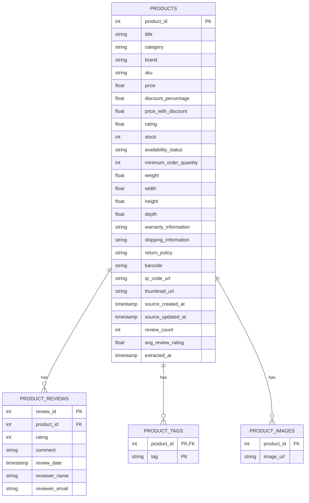

# Entity-Relationship Diagram

## Status
Reflects the tables written by the Transform/Load stages to
`data/output/*.csv` (current-state grain — one row per product, deduplicated
to the latest raw extraction snapshot; see
[docs/data-lineage.md](data-lineage.md)). Physically implemented today as
plain CSV files, one per entity, designed so each file can become a table in
a real relational database without changing shape.

## Diagram

## Notes
- **`PRODUCTS`** is the parent entity — current-state grain, one row per
  product, sourced from whichever raw snapshot was most recent at Transform
  time (see [ADR 0002](adr/0002-data-source-selection.md) on why "current
  state" instead of full history).
- **`PRODUCT_REVIEWS`**, **`PRODUCT_TAGS`**, and **`PRODUCT_IMAGES`**
  normalize the source API's multivalued fields (`reviews[]`, `tags[]`,
  `images[]`) into child tables in 1:N relationships with `PRODUCTS`.
- `review_id` is a **surrogate key** generated during Transform — the source
  has no natural review identifier.
- `(product_id, tag)` is a composite primary key on `PRODUCT_TAGS`, since a
  product cannot repeat the same tag.
- `PRODUCT_IMAGES` has no declared composite primary key: duplicate image
  URLs for the same product are structurally possible in the source and not
  worth rejecting.
- Replicating this model in an actual RDBMS means creating these four tables
  with the PK/FK constraints shown above and loading each CSV 1:1 into its
  table (`products.product_id` as the referenced key from the other three).
- Field-by-field types, nullability, and quality rules are formalized in
  [`contracts/`](../contracts/) (see
  [ADR 0004](adr/0004-data-contracts-approach.md)) and enforced at runtime by
  [`src/quality/expectations.py`](../src/quality/expectations.py) (see
  [ADR 0005](adr/0005-data-quality-great-expectations.md)).
